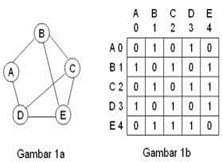

## Graph dan Tree
## Coding by Luthfi Adi Harianto
## NIM 2311102172
## Kelas : IF 11 E

## MODUL 9
## Graph and Tree

## Tujuan Praktikum
A. TUJUAN PRAKTIKUM
a. Mahasiswa diharapkan mampu memahami graph dan tree
b. Mahasiswa diharapkan mampu mengimplementasikan graph dan tree pada
pemrograman

## Dasar Teori
A. Binary Tree
Binary tree (Pohon Biner) Binary tree (Pohon Biner) adalah himpunan terbatas yang mungkin kosong atau terdiri dari sebuah simpul yang disebut akar dan dua buah himpunan lain yang disjoint yang disebut sub pohon kiri (left) dan sub pohon kanan (right). Karakteristik pohon biner adalah setiap simpul paling banyak hanya memiliki dua buah anak dan mungkin tidak punya anak.
</br>
Salah satu bentuk struktur data tidak linier yang menggambarkan hubungan yang hirarki. Ketentuan Tree Root (akar) adalah node yang memiliki derajat keluar >=0 dan derajat masuk = 0.
•	Subtree/child adalah bagian salah satu node dibawah root sampai ke bawah.
•	Leaf (daun) adalah semua node yang derajat masuknya 1 dan derajat keluarnya 0.
•	Height (ketinggian) adalah level tertinggi dari tree ditambah 1.
•	Weight (bobot) adalah jumlah leaf(daun) pada tree.
Sebuah binary search tree (bst) adalah sebuah pohon biner yang boleh kosong, dan setiap nodenya harus memiliki identifier/value. value pada semua node subpohon sebelah kiri adalah selalu lebih kecil dari value dari root, sedangkan value subpohon di sebelah kanan adalah sama atau lebih besar dari value pada root, masing – masing sub pohon tersebut (kiri&kanan) itu sendiri adalah juga bst.sebuah bst, pada dasarnya adalah sebuah pohon biner (binary tree), oleh karena itu, kita dapat melakukan traversal  pada  setiap  node  dengan metode inorder, preorder maupun postorder. dan jika kita melakukan traversal dengan metode inorder, pada dasarnya kita telah melakukan traversal valuenya secara terurut dari kecil ke besar, jadilah ini sebagai sorting algoritma.

B. Graph
</br>
Graph (Graf) Graph (Graf) adalah struktur data yang paling umum. Struktur graph memungkinkan keterhubungan tak terbatas antara entitas-entitas data.
Graf adalah kumpulan noktah (simpul) di dalam bidang dua dimensi yang dihubungkan dengan sekumpulan garis (sisi). Graph dapat digunakan untuk merepresentasikan objek-objek diskrit dan hubungan antara objek- objek tersebut. Representasi visual darigraph adalah dengan menyatakan objek sebagai noktah, bulatan atau titik (Vertex), sedangkan hubungan antara objek dinyatakan dengan garis (Edge).
G = (V, E)
Dimana
G = Graph
V = Simpul atau Vertex, atau Node, atau Titik
E = Busur atau Edge, atau arc Graf	merupakan	suatu	cabang
ilmu yang memiliki banyak terapan. Banyak sekali struktur yang bisa direpresentasikan dengan graf, dan banyak masalah yang bisa diselesaikan dengan bantuan graf. Seringkali graf digunakan untuk merepresentasikan suaru jaringan. Misalkan jaringan jalan raya  dimodelkan  graf  dengan  kota
sebagai simpul (vertex/node) dan jalan yang menghubungkan setiap kotanya sebagai sisi (edge) yang bobotnya (weight) adalah panjang dari jalan tersebut.
Ada beberapa cara untuk menyimpan graph di dalam sitem komputer. Struktur data bergantung pada struktur graph dan algoritma yang digunakan untuk memmanipulasi graph. Secara teori salah satu dari keduanya dapat dibedakan antara struktur list dan matriks, tetapi dalam penggunaannya struktur terbaik yang sering digunakan adalah kombinasi keduanya.
•	Graph tak berarah (undirected graph atau non-directed graph)
•	Urutan simpul dalam sebuah busur tidak dipentingkan. Misal busur e1 dapat disebut busur AB atau BA
•	Graph berarah (directed graph)
:
•	Urutan simpul mempunyai arti. Misal busur AB adalah e1 sedangkan busur BA adalah e8.
•	Graph Berbobot (Weighted Graph)
•	Jika setiap busur mempunyai nilai yang menyatakan hubungan antara 2 buah simpul, maka busur tersebut dinyatakan memiliki bobot.
•	Bobot sebuah busur dapat menyatakan panjang sebuah jalan dari 2 buah titik, jumlah rata-rata kendaraan perhari yang melalui sebuah jalan, dll.

## Guided
A. Guided 1
```C++
#include <iostream>
#include <iomanip>
using namespace std;
string simpul[7] = {
"Ciamis", 
"Bandung", 
"Bekasi", 
"tasikmalaya",
"Cianjur", 
"Purwokerto", 
"Yogyakarta"
};
int busur[7][7] = {
{0, 7, 8, 0, 0, 0, 0},
{0, 0, 5, 0, 0, 15, 0},
{0, 6, 0, 0, 5, 0, 0},
{0, 5, 0, 0, 2, 4, 0},
{23, 0, 0, 10, 0, 0, 8},
{0, 0, 0, 0, 7, 0, 3},
{0, 0, 0, 0, 9, 4, 0}
};
void tampilGraph(){
for (int baris = 0; baris <7; baris ++){
cout <<" " << setiosflags (ios::left)<<setw (15)
<< simpul [baris] << " : ";
for (int kolom = 0; kolom<7; kolom++){
if (busur[baris][kolom]!=0){
cout << " " << simpul[kolom]<< "(" << busur[baris][kolom] 
<< ")";
}
}
cout << endl;
} 
}
int main(){
tampilGraph();
return 0;
}
```
</br>
B. Guided 2
```C++
#include <iostream>
using namespace std;
// PROGRAM BINARY TREE
// Deklarasi Pohon
struct Pohon
{
    char data;
    Pohon *left, *right, *parent; // pointer
};
// pointer global
Pohon *root;
// Inisialisasi
void init()
{
    root = NULL;
}
bool isEmpty()
{
    return root == NULL;
}
Pohon *newPohon(char data)
{
    Pohon *node = new Pohon();
    node->data = data;
    node->left = NULL;
    node->right = NULL;
    node->parent = NULL;
    return node;
}
void buatNode(char data)
{
    if (isEmpty())
    {
        root = newPohon(data);
        cout << "\nNode " << data << " berhasil dibuat menjadi root." << endl;
    }
    else
    {
        cout << "\nPohon sudah dibuat" << endl;
    }
}
Pohon *insertLeft(char data, Pohon *node)
{
    if (isEmpty())
    {
        cout << "\nBuat tree terlebih dahulu!" << endl;
        return NULL;
    }
    else
    {
        if (node->left != NULL)
        {
            cout << "\nNode " << node->data << " sudah ada child kiri!"

                 << endl;

            return NULL;
        }
        else
        {
            Pohon *baru = newPohon(data);
            baru->parent = node;
            node->left = baru;
            cout << "\nNode " << data << " berhasil ditambahkan ke child kiri " << node->data << endl;
                return baru;
        }
    }
}
Pohon *insertRight(char data, Pohon *node)
{
    if (isEmpty())
    {
        cout << "\nBuat tree terlebih dahulu!" << endl;
        return NULL;
    }
    else
    {
        if (node->right != NULL)
        {
            cout << "\nNode " << node->data << " sudah ada child kanan!"

                 << endl;

            return NULL;
        }
        else
        {
            Pohon *baru = newPohon(data);
            baru->parent = node;
            node->right = baru;
            cout << "\nNode " << data << " berhasil ditambahkan ke child kanan " << node->data << endl;
                return baru;
        }
    }
}
void update(char data, Pohon *node)
{
    if (isEmpty())
    {
        cout << "\nBuat tree terlebih dahulu!" << endl;
    }
    else
    {
        if (!node)
            cout << "\nNode yang ingin diganti tidak ada!!" << endl;
        else
        {
            char temp = node->data;
            node->data = data;
            cout << "\nNode " << temp << " berhasil diubah menjadi " <<

                data << endl;
        }
    }
}
void retrieve(Pohon *node)
{
    if (isEmpty())
    {
        cout << "\nBuat tree terlebih dahulu!" << endl;
    }
    else
    {
        if (!node)
            cout << "\nNode yang ditunjuk tidak ada!" << endl;
        else
        {
            cout << "\nData node : " << node->data << endl;
        }
    }
}
void find(Pohon *node)
{
    if (isEmpty())
    {
        cout << "\nBuat tree terlebih dahulu!" << endl;
    }
    else
    {
        if (!node)
            cout << "\nNode yang ditunjuk tidak ada!" << endl;
        else
        {
            cout << "\nData Node : " << node->data << endl;
            cout << "Root : " << root->data << endl;
            if (!node->parent)
                cout << "Parent : (tidak punya parent)" << endl;
            else
                cout << "Parent : " << node->parent->data << endl;
            if (node->parent != NULL && node->parent->left != node &&

                node->parent->right == node)

                cout << "Sibling : " << node->parent->left->data << endl;
            else if (node->parent != NULL && node->parent->right != node

                     && node->parent->left == node)

                cout << "Sibling : " << node->parent->right->data <<

                    endl;

            else
                cout << "Sibling : (tidak punya sibling)" << endl;
            if (!node->left)
                cout << "Child Kiri : (tidak punya Child kiri)" << endl;
            else
                cout << "Child Kiri : " << node->left->data << endl;
            if (!node->right)
                cout << "Child Kanan : (tidak punya Child kanan)" <<

                    endl;

            else
                cout << "Child Kanan : " << node->right->data << endl;
        }
    }
}
// Penelusuran (Traversal)
// preOrder
void preOrder(Pohon *node)
{
    if (isEmpty())
        cout << "\nBuat tree terlebih dahulu!" << endl;
    else
    {
        if (node != NULL)
        {
            cout << " " << node->data << ", ";
            preOrder(node->left);
            preOrder(node->right);
        }
    }
}
// inOrder
void inOrder(Pohon *node)
{
    if (isEmpty())
        cout << "\nBuat tree terlebih dahulu!" << endl;
    else
    {
        if (node != NULL)
        {
            inOrder(node->left);
            cout << " " << node->data << ", ";
            inOrder(node->right);
        }
    }
}
// postOrder
void postOrder(Pohon *node)
{
    if (isEmpty())
        cout << "\nBuat tree terlebih dahulu!" << endl;
    else
    {
        if (node != NULL)
        {
            postOrder(node->left);
            postOrder(node->right);
            cout << " " << node->data << ", ";
        }
    }
}
// Hapus Node Tree
void deleteTree(Pohon *node)
{
    if (isEmpty())
        cout << "\nBuat tree terlebih dahulu!" << endl;
    else
    {
        if (node != NULL)
        {
            if (node != root)
            {
                if (node->parent->left == node)
                    node->parent->left = NULL;
                else if (node->parent->right == node)
                    node->parent->right = NULL;
            }
            deleteTree(node->left);
            deleteTree(node->right);
            if (node == root)
            {
                delete root;
                root = NULL;
            }
            else
            {
                delete node;
            }
        }
    }
}
// Hapus SubTree
void deleteSub(Pohon *node)
{
    if (isEmpty())
        cout << "\nBuat tree terlebih dahulu!" << endl;
    else
    {
        deleteTree(node->left);
        deleteTree(node->right);
        cout << "\nNode subtree " << node->data << " berhasil dihapus."
             << endl;
    }
}
// Hapus Tree
void clear()
{
    if (isEmpty())
        cout << "\nBuat tree terlebih dahulu!!" << endl;
    else
    {
        deleteTree(root);
        cout << "\nPohon berhasil dihapus." << endl;
    }
}
// Cek Size Tree
int size(Pohon *node)
{
    if (isEmpty())
    {
        cout << "\nBuat tree terlebih dahulu!!" << endl;
        return 0;
    }
    else
    {
        if (!node)
        {
            return 0;
        }
        else
        {
            return 1 + size(node->left) + size(node->right);
        }
    }
}
// Cek Height Level Tree
int height(Pohon *node)
{
    if (isEmpty())
    {
        cout << "\nBuat tree terlebih dahulu!" << endl;
        return 0;
    }
    else
    {
        if (!node)
        {
            return 0;
        }
        else
        {
            int heightKiri = height(node->left);
            int heightKanan = height(node->right);
            if (heightKiri >= heightKanan)
            {
                return heightKiri + 1;
            }
            else
            {
                return heightKanan + 1;
            }
        }
    }
}
// Karakteristik Tree
void characteristic()
{
    int s = size(root);
    int h = height(root);
    cout << "\nSize Tree : " << s << endl;
    cout << "Height Tree : " << h << endl;
    if (h != 0)
        cout << "Average Node of Tree : " << s / h << endl;
    else
        cout << "Average Node of Tree : 0" << endl;
}
int main()
{
    init();
    buatNode('A');
    Pohon *nodeB, *nodeC, *nodeD, *nodeE, *nodeF, *nodeG, *nodeH, *nodeI,
        *nodeJ;
    nodeB = insertLeft('B', root);
    nodeC = insertRight('C', root);
    nodeD = insertLeft('D', nodeB);
    nodeE = insertRight('E', nodeB);
    nodeF = insertLeft('F', nodeC);
    nodeG = insertLeft('G', nodeE);
    nodeH = insertRight('H', nodeE);
    nodeI = insertLeft('I', nodeG);
    nodeJ = insertRight('J', nodeG);
    update('Z', nodeC);
    update('C', nodeC);
    retrieve(nodeC);
    find(nodeC);
    cout << "\nPreOrder :" << endl;
    preOrder(root);
    cout << "\n"
         << endl;
    cout << "InOrder :" << endl;
    inOrder(root);
    cout << "\n"
         << endl;
    cout << "PostOrder :" << endl;
    postOrder(root);
    cout << "\n"
         << endl;
    characteristic();
    deleteSub(nodeE);
    cout << "\nPreOrder :" << endl;
    preOrder(root);
    cout << "\n"
         << endl;
    characteristic();
}
```
</br>
</br>
## UNGUIDED
A. Unguided 1
``` C++
#include <iostream>
#include <limits>

using namespace std;

int main() {
  int n_2311102172;
  cout << "Silakan masukan jumlah simpul: ";
  cin >> n_2311102172;

  // Inisialisasi array untuk menyimpan nama kota
  string kota[n_2311102172];
  cout << "Silakan masukan nama simpul\n";
  for (int i = 0; i < n_2311102172; i++) {
    cout << "Simpul " << i + 1 << ": ";
    cin >> kota[i];
  }

  // Inisialisasi array 2D untuk menyimpan bobot antar kota
  int graph[n_2311102172][n_2311102172];
  cout << "Silakan masukkan bobot antar simpul\n";
  for (int i = 0; i < n_2311102172; i++) {
    for (int j = 0; j < n_2311102172; j++) {
      cout << kota[i] << "--> " << kota[j] << " = ";
      cin >> graph[i][j];
    }
  }

  // Menampilkan matriks graph
  cout << "\n";
  cout << "  ";
  for (int i = 0; i < n_2311102172; i++) {
    cout << kota[i] << " ";
  }
  cout << "\n";
  for (int i = 0; i < n_2311102172; i++) {
    cout << kota[i] << " ";
    for (int j = 0; j < n_2311102172; j++) {
      cout << graph[i][j] << " ";
    }
    cout << "\n";
  }

  // Input kota asal dan tujuan
  int asal, tujuan;
  cout << "\n";
  cout << "Masukan kota asal (nomor simpul): ";
  while (!(cin >> asal) || asal < 1 || asal > n_2311102172) {
    cout << "Input tidak valid. Masukan nomor simpul yang benar: ";
    cin.clear();
    cin.ignore(numeric_limits<streamsize>::max(), '\n');
  }
  asal--; // Penyesuaian indeks array

  cout << "Masukan kota tujuan (nomor simpul): ";
  while (!(cin >> tujuan) || tujuan < 1 || tujuan > n_2311102172) {
    cout << "Input tidak valid. Masukan nomor simpul yang benar: ";
    cin.clear();
    cin.ignore(numeric_limits<streamsize>::max(), '\n');
  }
  tujuan--; // Penyesuaian indeks array

  // Menghitung jarak antar kota
  int jarak = graph[asal][tujuan];
  cout << "\nJarak dari " << kota[asal] << " ke " << kota[tujuan] << " adalah: " << jarak << endl;

  return 0;
}
```
</br>
</br>
Program ini akan meminta input sesuai dengan format yang diinginkan dan memberikan output jarak terpendek antara dua kota yang dimasukkan oleh pengguna.

B. Unguided 2
```C++
#include <iostream>
#include <queue>
using namespace std;

// PROGRAM BINARY TREE
// Deklarasi Pohon
struct Pohon {
    char data;
    Pohon *left, *right, *parent; // pointer
};

// pointer global
Pohon *root;

// Inisialisasi
void init_2311102172() {
    root = NULL;
}

bool isEmpty() {
    return root == NULL;
}

Pohon *newPohon(char data) {
    Pohon *node = new Pohon();
    node->data = data;
    node->left = NULL;
    node->right = NULL;
    node->parent = NULL;
    return node;
}

void buatNode(char data) {
    if (isEmpty()) {
        root = newPohon(data);
        cout << "\nNode " << data << " berhasil dibuat menjadi root." << endl;
    } else {
        cout << "\nPohon sudah dibuat" << endl;
    }
}

Pohon *insertLeft(char data, Pohon *node) {
    if (isEmpty()) {
        cout << "\nBuat tree terlebih dahulu!" << endl;
        return NULL;
    } else {
        if (node->left != NULL) {
            cout << "\nNode " << node->data << " sudah ada child kiri!" << endl;
            return NULL;
        } else {
            Pohon *baru = newPohon(data);
            baru->parent = node;
            node->left = baru;
            cout << "\nNode " << data << " berhasil ditambahkan ke child kiri " << node->data << endl;
            return baru;
        }
    }
}

Pohon *insertRight(char data, Pohon *node) {
    if (isEmpty()) {
        cout << "\nBuat tree terlebih dahulu!" << endl;
        return NULL;
    } else {
        if (node->right != NULL) {
            cout << "\nNode " << node->data << " sudah ada child kanan!" << endl;
            return NULL;
        } else {
            Pohon *baru = newPohon(data);
            baru->parent = node;
            node->right = baru;
            cout << "\nNode " << data << " berhasil ditambahkan ke child kanan " << node->data << endl;
            return baru;
        }
    }
}

void update(char data, Pohon *node) {
    if (isEmpty()) {
        cout << "\nBuat tree terlebih dahulu!" << endl;
    } else {
        if (!node)
            cout << "\nNode yang ingin diganti tidak ada!!" << endl;
        else {
            char temp = node->data;
            node->data = data;
            cout << "\nNode " << temp << " berhasil diubah menjadi " << data << endl;
        }
    }
}

void retrieve(Pohon *node) {
    if (isEmpty()) {
        cout << "\nBuat tree terlebih dahulu!" << endl;
    } else {
        if (!node)
            cout << "\nNode yang ditunjuk tidak ada!" << endl;
        else {
            cout << "\nData node : " << node->data << endl;
        }
    }
}

void find(Pohon *node) {
    if (isEmpty()) {
        cout << "\nBuat tree terlebih dahulu!" << endl;
    } else {
        if (!node)
            cout << "\nNode yang ditunjuk tidak ada!" << endl;
        else {
            cout << "\nData Node : " << node->data << endl;
            cout << "Root : " << root->data << endl;
            if (!node->parent)
                cout << "Parent : (tidak punya parent)" << endl;
            else
                cout << "Parent : " << node->parent->data << endl;
            if (node->parent != NULL && node->parent->left != node && node->parent->right == node)
                cout << "Sibling : " << node->parent->left->data << endl;
            else if (node->parent != NULL && node->parent->right != node && node->parent->left == node)
                cout << "Sibling : " << node->parent->right->data << endl;
            else
                cout << "Sibling : (tidak punya sibling)" << endl;
            if (!node->left)
                cout << "Child Kiri : (tidak punya Child kiri)" << endl;
            else
                cout << "Child Kiri : " << node->left->data << endl;
            if (!node->right)
                cout << "Child Kanan : (tidak punya Child kanan)" << endl;
            else
                cout << "Child Kanan : " << node->right->data << endl;
        }
    }
}

void preOrder(Pohon *node) {
    if (isEmpty())
        cout << "\nBuat tree terlebih dahulu!" << endl;
    else {
        if (node != NULL) {
            cout << " " << node->data << ", ";
            preOrder(node->left);
            preOrder(node->right);
        }
    }
}

void inOrder(Pohon *node) {
    if (isEmpty())
        cout << "\nBuat tree terlebih dahulu!" << endl;
    else {
        if (node != NULL) {
            inOrder(node->left);
            cout << " " << node->data << ", ";
            inOrder(node->right);
        }
    }
}

void postOrder(Pohon *node) {
    if (isEmpty())
        cout << "\nBuat tree terlebih dahulu!" << endl;
    else {
        if (node != NULL) {
            postOrder(node->left);
            postOrder(node->right);
            cout << " " << node->data << ", ";
        }
    }
}

void deleteTree(Pohon *node) {
    if (isEmpty())
        cout << "\nBuat tree terlebih dahulu!" << endl;
    else {
        if (node != NULL) {
            if (node != root) {
                if (node->parent->left == node)
                    node->parent->left = NULL;
                else if (node->parent->right == node)
                    node->parent->right = NULL;
            }
            deleteTree(node->left);
            deleteTree(node->right);
            if (node == root) {
                delete root;
                root = NULL;
            } else {
                delete node;
            }
        }
    }
}

void deleteSub(Pohon *node) {
    if (isEmpty())
        cout << "\nBuat tree terlebih dahulu!" << endl;
    else {
        deleteTree(node->left);
        deleteTree(node->right);
        cout << "\nNode subtree " << node->data << " berhasil dihapus." << endl;
    }
}

void clear() {
    if (isEmpty())
        cout << "\nBuat tree terlebih dahulu!!" << endl;
    else {
        deleteTree(root);
        cout << "\nPohon berhasil dihapus." << endl;
    }
}

int size(Pohon *node) {
    if (isEmpty()) {
        cout << "\nBuat tree terlebih dahulu!!" << endl;
        return 0;
    } else {
        if (!node) {
            return 0;
        } else {
            return 1 + size(node->left) + size(node->right);
        }
    }
}

int height(Pohon *node) {
    if (isEmpty()) {
        cout << "\nBuat tree terlebih dahulu!" << endl;
        return 0;
    } else {
        if (!node) {
            return 0;
        } else {
            int heightKiri = height(node->left);
            int heightKanan = height(node->right);
            if (heightKiri >= heightKanan) {
                return heightKiri + 1;
            } else {
                return heightKanan + 1;
            }
        }
    }
}

void characteristic() {
    int s = size(root);
    int h = height(root);
    cout << "\nSize Tree : " << s << endl;
    cout << "Height Tree : " << h << endl;
    if (h != 0)
        cout << "Average Node of Tree : " << s / h << endl;
    else
        cout << "Average Node of Tree : 0" << endl;
}

void tampilkanChild(Pohon *node) {
    if (isEmpty()) {
        cout << "\nBuat tree terlebih dahulu!" << endl;
    } else {
        if (!node) {
            cout << "\nNode yang ditunjuk tidak ada!" << endl;
        } else {
            cout << "\nChild dari node " << node->data << ": ";
            if (node->left) {
                cout << "Kiri: " << node->left->data << " ";
            } else {
                cout << "Kiri: (tidak punya child kiri) ";
            }
            if (node->right) {
                cout << "Kanan: " << node->right->data << endl;
            } else {
                cout << "Kanan: (tidak punya child kanan) " << endl;
            }
        }
    }
}

void tampilkanDescendant(Pohon *node) {
    if (isEmpty()) {
        cout << "\nBuat tree terlebih dahulu!" << endl;
    } else {
        if (!node) {
            cout << "\nNode yang ditunjuk tidak ada!" << endl;
        } else {
            cout << "\nDescendant dari node " << node->data << ": ";
            queue<Pohon*> q;
            q.push(node);
            while (!q.empty()) {
                Pohon* temp = q.front();
                q.pop();
                if (temp->left) {
                    cout << temp->left->data << " ";
                    q.push(temp->left);
                }
                if (temp->right) {
                    cout << temp->right->data << " ";
                    q.push(temp->right);
                }
            }
            cout << endl;
        }
    }
}

int main() {
    init_2311102172();
    char pilihan, data, parent;
    Pohon *node = NULL, *parentNode = NULL;
    
    do {
        cout << "\nMenu:" << endl;
        cout << "1. Buat Root" << endl;
        cout << "2. Tambah Child Kiri" << endl;
        cout << "3. Tambah Child Kanan" << endl;
        cout << "4. Update Node" << endl;
        cout << "5. Tampilkan Child" << endl;
        cout << "6. Tampilkan Descendant" << endl;
        cout << "7. PreOrder Traversal" << endl;
        cout << "8. InOrder Traversal" << endl;
        cout << "9. PostOrder Traversal" << endl;
        cout << "10. Hapus Subtree" << endl;
        cout << "11. Hapus Tree" << endl;
        cout << "12. Exit" << endl;
        cout << "Pilihan: ";
        cin >> pilihan;
        
        switch(pilihan) {
            case '1':
                cout << "Masukkan data root: ";
                cin >> data;
                buatNode(data);
                break;
            case '2':
                cout << "Masukkan data child kiri: ";
                cin >> data;
                cout << "Masukkan data parent: ";
                cin >> parent;
                parentNode = NULL;
                if (root) {
                    queue<Pohon*> q;
                    q.push(root);
                    while (!q.empty()) {
                        Pohon* temp = q.front();
                        q.pop();
                        if (temp->data == parent) {
                            parentNode = temp;
                            break;
                        }
                        if (temp->left) q.push(temp->left);
                        if (temp->right) q.push(temp->right);
                    }
                }
                if (parentNode) {
                    insertLeft(data, parentNode);
                } else {
                    cout << "Parent tidak ditemukan!" << endl;
                }
                break;
            case '3':
                cout << "Masukkan data child kanan: ";
                cin >> data;
                cout << "Masukkan data parent: ";
                cin >> parent;
                parentNode = NULL;
                if (root) {
                    queue<Pohon*> q;
                    q.push(root);
                    while (!q.empty()) {
                        Pohon* temp = q.front();
                        q.pop();
                        if (temp->data == parent) {
                            parentNode = temp;
                            break;
                        }
                        if (temp->left) q.push(temp->left);
                        if (temp->right) q.push(temp->right);
                    }
                }
                if (parentNode) {
                    insertRight(data, parentNode);
                } else {
                    cout << "Parent tidak ditemukan!" << endl;
                }
                break;
            case '4':
                cout << "Masukkan data node baru: ";
                cin >> data;
                cout << "Masukkan data node yang ingin diupdate: ";
                cin >> parent;
                parentNode = NULL;
                if (root) {
                    queue<Pohon*> q;
                    q.push(root);
                    while (!q.empty()) {
                        Pohon* temp = q.front();
                        q.pop();
                        if (temp->data == parent) {
                            parentNode = temp;
                            break;
                        }
                        if (temp->left) q.push(temp->left);
                        if (temp->right) q.push(temp->right);
                    }
                }
                if (parentNode) {
                    update(data, parentNode);
                } else {
                    cout << "Node tidak ditemukan!" << endl;
                }
                break;
            case '5':
                cout << "Masukkan data node: ";
                cin >> data;
                node = NULL;
                if (root) {
                    queue<Pohon*> q;
                    q.push(root);
                    while (!q.empty()) {
                        Pohon* temp = q.front();
                        q.pop();
                        if (temp->data == data) {
                            node = temp;
                            break;
                        }
                        if (temp->left) q.push(temp->left);
                        if (temp->right) q.push(temp->right);
                    }
                }
                tampilkanChild(node);
                break;
            case '6':
                cout << "Masukkan data node: ";
                cin >> data;
                node = NULL;
                if (root) {
                    queue<Pohon*> q;
                    q.push(root);
                    while (!q.empty()) {
                        Pohon* temp = q.front();
                        q.pop();
                        if (temp->data == data) {
                            node = temp;
                            break;
                        }
                        if (temp->left) q.push(temp->left);
                        if (temp->right) q.push(temp->right);
                    }
                }
                tampilkanDescendant(node);
                break;
            case '7':
                cout << "\nPreOrder Traversal:" << endl;
                preOrder(root);
                cout << endl;
                break;
            case '8':
                cout << "\nInOrder Traversal:" << endl;
                inOrder(root);
                cout << endl;
                break;
            case '9':
                cout << "\nPostOrder Traversal:" << endl;
                postOrder(root);
                cout << endl;
                break;
            case '10':
                cout << "Masukkan data node subtree yang ingin dihapus: ";
                cin >> data;
                node = NULL;
                if (root) {
                    queue<Pohon*> q;
                    q.push(root);
                    while (!q.empty()) {
                        Pohon* temp = q.front();
                        q.pop();
                        if (temp->data == data) {
                            node = temp;
                            break;
                        }
                        if (temp->left) q.push(temp->left);
                        if (temp->right) q.push(temp->right);
                    }
                }
                deleteSub(node);
                break;
            case '11':
                clear();
                break;
            case '12':
                cout << "Terima kasih!" << endl;
                break;
            default:
                cout << "Pilihan tidak valid!" << endl;
                break;
        }
    } while (pilihan != '12');
    
    return 0;
}
```
</br> 
 </br>
 </br>
 </br>
 </br>
 </br>
 </br>
Program ini memungkinkan pengguna untuk memasukkan data pohon melalui menu dan menampilkan child serta descendant dari node tertentu sesuai permintaan.

## Kesimpulan
 Binary Tree lebih dikenal sebagai Pohon Umum (General Tree) yang dapat didefinisikan sebagai kumpulan simpul yang mungkin kosong atau mempunyai akar dan dua Subpohon yang saling terpisah yang disebut dengan Subpohon Kiri/cabang kiri (Left Subtree) dan Subpohon Kanan/cabang kanan (Right Subtree).Sedangkan,Graph merupakan struktur data yang paling umum. Jika struktur linear memungkinkan pendefinisian keterhubungan sikuensial antara entitas data, struktur data tree memungkinkan pendefinisian keterhubungan hirarkis, maka struktur graph memungkinkan pendefinisian keterhubungan tak terbatas antara entitas data.
 
 ## Daftar Pustaka
 [1] Karumanchi, N. (2011). Data Structures and Algorithms Made Easy: 700 Data Structure and 
Algorithmic Puzzles. CreateSpace
[2] Safei, M. Rian. "PENGERTIAN STRUKTUR DATA NON LINIER." (2019).
[3] Holle, Khadijah Fahmi Hayati. "Modul praktikum struktur data." (2022).