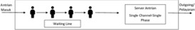

## Queue
## Coding by Luthfi Adi Harianto
## NIM 2311102172
## Kelas : IF 11 E

## MODUL 7
## Queue

A. TUJUAN PRAKTIKUM
1. Mahasiswa mampu menjelaskan definisi dan konsep dari double queue
2. Mahasiswa mampu menerapkan operasi tambah, menghapus pada queue
3. Mahasiswa mampu menerapkan operasi tampil data pada queue

B. Dasar Teori
## Queue
Queue atau antrian adalah suatu jenis struktur data yang dapat diproses dengan sifat FIFO (First In First Out), dimana elemen yang pertama kali masuk ke antrian akan keluar pertama kali. Ada dua jenis operasi yang bisa dilakukan di antrian: enqueue (memasukkan elemen baru ke dalam elemen) dan dequeue (adalah mengeluarkan satu elemen dari suatu antrian). Antrian dapat dibuat dengan menggunakan: Linear Array dan Circular Array.
## First in First out
First-In First-Out (FIFO) adalah sebuah metode pemecahan dalam masalah antrian yang dapat diterapkan dengan cara laporan pengaduan yang pertama kali masuk diasumsikan keluar pertama kali.Hal ini sudah berjalan sesuai dengan mekanisme
antrian pada umumnya, dimana antrian yang pertama kali masuk akan diselesaikan atau dilayani terlebih dahulu. 

</br>
Penggunaan algoritma FIFO ini dimaksudkan agar urutan antrian pasien tetap pada urutan yang benar tanpa merubah urutan yang sudah ada. Penerapan algoritma ini membuat tidak mungkin pasien dapat melakukan kecurangan terhadap antrian yang dapat menimbulkan masalah yang sama seperti ketika antrian dijalankan secara offline atau luring.

## Guided
```C++
#include <iostream>
using namespace std;
const int maksimalQueue = 5; // Maksimal antrian
int front = 0; // Penanda antrian
int back = 0; // Penanda
string queueTeller[5]; // Fungsi pengecekan
bool isFull() { // Pengecekan antrian penuh atau tidak
if (back == maksimalQueue) {
return true; // =1
} else {
return false;
}
}
bool isEmpty() { // Antriannya kosong atau tidak
if (back == 0) {
return true;
} else {
return false;
}
}
void enqueueAntrian(string data) { // Fungsi menambahkan antrian
if (isFull()) {
cout << "Antrian penuh" << endl;
} else {
if (isEmpty()) { // Kondisi ketika queue kosong
queueTeller[0] = data;
front++;
back++;
} else { // Antrianya ada isi
queueTeller[back] = data;
back++;
}
}
}
void dequeueAntrian() { // Fungsi mengurangi antrian
if (isEmpty()) {
cout << "Antrian kosong" << endl;
} else {
for (int i = 0; i < back; i++) {
queueTeller[i] = queueTeller[i + 1];
}
back--;
}
}
int countQueue() { // Fungsi menghitung banyak antrian
return back;
}
void clearQueue() { // Fungsi menghapus semua antrian
if (isEmpty()) {
cout << "Antrian kosong" << endl;
} else {
for (int i = 0; i < back; i++) {
queueTeller[i] = "";
}
back = 0;
front = 0;
}
}
void viewQueue() { // Fungsi melihat antrian
cout << "Data antrian teller:" << endl;
for (int i = 0; i < maksimalQueue; i++) {
if (queueTeller[i] != "") {
cout << i + 1 << ". " << queueTeller[i] <<
endl;
} else {
cout << i + 1 << ". (kosong)" << endl;
}
}
}
int main() {
enqueueAntrian("Andi");
enqueueAntrian("Maya");
viewQueue();
cout << "Jumlah antrian = " << countQueue() << endl;
dequeueAntrian();
viewQueue();
cout << "Jumlah antrian = " << countQueue() << endl;
clearQueue();
viewQueue();
cout << "Jumlah antrian = " << countQueue() << endl;
return 0;
}
```
</br>
</br>
</br>
Program tersebut digunakan untuk sistem antrian seperti di bank, swalayan, atau loket pembayaran pada toko, KAI, maupun pemesanan tiket bioskop, dan pesawat. 

## UNGUIDED
Unguided 1
```C++
#include <iostream>
using namespace std;

struct Node {
    string data;
    Node* next;
};

Node* front = NULL;
Node* back = NULL;

bool isEmpty() {
    return (front == NULL);
}

void enqueueAntrian(string data) {
    Node* temp = new Node();
    temp->data = data;
    temp->next = NULL;
    if(front == NULL && back == NULL){
        front = back = temp;
        return;
    }
    back->next = temp;
    back = temp;
}

void dequeueAntrian() {
    Node* temp = front;
    if(front == NULL) {
        cout << "Antrian kosong" << endl;
        return;
    }
    if(front == back) {
        front = back = NULL;
    }
    else {
        front = front->next;
    }
    delete temp;
}

int countQueue() {
    Node* temp = front;
    int count = 0;
    while(temp != NULL){
        count++;
        temp = temp->next;
    }
    return count;
}

void clearQueue() {
    Node* current = front;
    Node* next;
 
    while (current != NULL) {
        next = current->next;
        delete current;
        current = next;
    }
    front = back = NULL;
}

void viewQueue() {
    Node* temp = front;
    cout << "Data antrian teller:" << endl;
    int i = 1;
    while(temp!=NULL) {
        cout << i << ". " << temp->data << endl;
        temp = temp->next;
        i++;
    }
}

int main() {
    enqueueAntrian("Andi");
    enqueueAntrian("Maya");
    viewQueue();
    cout << "Jumlah antrian = " << countQueue() << endl;
    dequeueAntrian();
    viewQueue();
    cout << "Jumlah antrian = " << countQueue() << endl;
    clearQueue();
    viewQueue();
    cout << "Jumlah antrian = " << countQueue() << endl;
    return 0;
}
```
</br>
</br>
Program tersebut digunakan untuk sistem antrian seperti loket pembayaran, dengan enqueue antrian kita bisa menambahkan list nama pelanggan yang ingin memesan atau membayar. selanjutnya dengan viewqueue kita bisa melihat nama pelanggan yang sudah kita inputkan, lalu dengan dequeue kita bisa mengeluarkan nama paling atas dari list pemesanan/pembayaran dari antrian. dengan clearqueue kita bisa menghapus list yang sudah kita buat

## Unguided
Unguided 2
``` C++
#include <iostream>
using namespace std;

struct Mahasiswa {
    string nama;
    string nim;
};

struct Node {
    Mahasiswa data;
    Node* next;
};

Node* front = NULL;
Node* back = NULL;

bool isEmpty() {
    return (front == NULL);
}

void enqueueAntrian(Mahasiswa data) {
    Node* temp = new Node();
    temp->data = data;
    temp->next = NULL;
    if(front == NULL && back == NULL){
        front = back = temp;
        return;
    }
    back->next = temp;
    back = temp;
}

void dequeueAntrian() {
    Node* temp = front;
    if(front == NULL) {
        cout << "Antrian kosong" << endl;
        return;
    }
    if(front == back) {
        front = back = NULL;
    }
    else {
        front = front->next;
    }
    delete temp;
}

int countQueue() {
    Node* temp = front;
    int count = 0;
    while(temp != NULL){
        count++;
        temp = temp->next;
    }
    return count;
}

void clearQueue() {
    Node* current = front;
    Node* next;
 
    while (current != NULL) {
        next = current->next;
        delete current;
        current = next;
    }
    front = back = NULL;
}

void viewQueue() {
    Node* temp = front;
    cout << "Data antrian mahasiswa:" << endl;
    int i = 1;
    while(temp!=NULL) {
        cout << i << ". Nama: " << temp->data.nama << ", NIM: " << temp->data.nim << endl;
        temp = temp->next;
        i++;
    }
}

int main() {
    Mahasiswa mhs1 = {"Andi", "123456"};
    Mahasiswa mhs2 = {"Maya", "654321"};
    enqueueAntrian(mhs1);
    enqueueAntrian(mhs2);
    viewQueue();
    cout << "Jumlah antrian = " << countQueue() << endl;
    dequeueAntrian();
    viewQueue();
    cout << "Jumlah antrian = " << countQueue() << endl;
    clearQueue();
    viewQueue();
    cout << "Jumlah antrian = " << countQueue() << endl;
    return 0;
}
```
</br>
</br>
Program tersebut digunakan untuk mengelola antrian mahasiswa ataupun sistem layananan akademik, kode program hampir sama dengan unguided pertama tapi terdapat perbedaan, yaitu terletak di struct mahasiswa kode tersebut digunakan untuk membuat list nama dan nim mahasiswa yang kita inginkan untuk ditambahkan dengan enqueue antrian kita bisa menambahkan list nama mahasiswa dan nim. selanjutnya dengan viewqueue kita bisa melihat nama mahasiswa beserta nim yang sudah kita inputkan, lalu dengan dequeue kita bisa mengeluarkan nama mahasiswa beserta nim paling atas dari list nama nim mahasiswa yang sudah kita buat. dengan clearqueue kita bisa menghapus list yang sudah kita buat.

## Kesimpulan
Queue memiliki banyak kegunaan dan keuntungan diantaranya mengelola antrian, pencarian dan pengurutan algoritma, selain itu queue sangat mudah dipahami dimana terdapat fungsi enqueue dan dequeue yang memudahkan programer untuk memahami dan membuat program, selain itu queue cocok untuk situasi penyisipan penting. tapi queue sendiri tidak sempurna masih terdapat kekurangan dalam queue diantaranya: tidak dapat akses acak ke elemen dan tidak dapat mengubah urutan elemen data yang sudah dibuat

## Daftar Pustaka
[1]Karumanchi, N. (2016). Data Structures and algorithms made easy: Concepts,
problems, Interview Questions. CareerMonk Publications.
[2]Gunawan, Rizaldy, Haris Yuana, and Sabitul Kirom. "IMPLEMENTASI METODE QUEUE PADA SISTEM ANTRIAN ONLINE BERBASIS WEB STUDI KASUS UPTD PUSKESMAS SANANWETAN." JATI (Jurnal Mahasiswa Teknik Informatika) 7.3 (2023): 1538-1545.
[3]Santoso, Joko Dwi. "Analisis Perbandingan Metode Queue Pada Mikrotik." Pseudocode 7.1 (2020): 1-7.