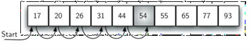

## Searching
## Coding by Luthfi Adi Harianto
## NIM 2311102172
## Kelas : IF 11 E

## MODUL 8
## Searching

A. TUJUAN PRAKTIKUM
a. Menunjukkan beberapa algoritma dalam Pencarian.
b. Menunjukkan bahwa pencarian merupakan suatu persoalan yang bisa diselesaikan
dengan beberapa algoritma yang berbeda.
c. Dapat memilih algoritma yang paling sesuai untuk menyelesaikan suatu 
permasalahan pemrograman.

B. Dasar Teori
Pencarian merupakan proses yang fundamental dalam pengolahan data. Sequential Searching merupakan algoritma pencarian beruntun yang prosesnya membandingkan setiap elemen satu persatu secara beruntun, mulai dari elemen pertama sampai elemen yang di cari di temukan atau seluruh elemen sudah di periksa. Dalam sistem yang akan dibuat dalam peneliian ini, fitur pencarian menggunakan algoritma Sequential Searching untuk mencari nomor surat yang telah di arsipkan. Data arsip yang telah tersimpan di dalam database di kumpulkan pada sebuah Array lalu dari Array tersebut akan di lakukan proses pencarian dengan algoritma Sequential Searching. Jika data yang di cari ada di dalam Array maka data tersebut akan di tampilkan. Jika tidak ada maka akan menampilkan pesan bahwa data tidak ada.
1. 	Algoritma Sequential Searching
Sequential Search adalah proses membandingkan setiap elemen array satu persatu secara beruntun dimulai dari elemen pertama hingga elemen yang dicari ditemukan atau hingga elemen terakhir dari array[4]. Metode Sequential Search atau disebut pencarian beruntun dapat digunakan untuk melakukan pencarian data baik pada array yang sudah terurut maupun yang belum terurut. Proses yang terjadi pada metode pencarian ini adalah sebagai berikut [1] : (1) Membaca array data. (2) Menentukan data yang dicari. (3) Mulai dari data pertama sampai dengan data terakhir, data yang dicari dibandingkan dengan masing-masing data di dalam array. Jika data yang dicari tidak ditemukan maka semua data atau elemen array dibandingkan sampai selesai. Jika data yang dicari ditemukan maka perbandingan akan dihentikan
Proses pencarian data dengan metode ini cukup sederhana dan mudah. Proses pencarian data dilakukan dengan mencocokkan data yang dilakukan secara berurut satu demi satu dimulai dari data ke-1 hingga data pada urutan terakhir. Jika data yang dicari mempunyai nilai yang sama dengan data yang ada dalam kelompok data, berarti data telah ditemukan. Jika data yang dicari tidak ada yang cocok dengan data dalam sekelompok data, data tersebut tidak ada dalam sekelompok data. Selanjutnya kita tinggal menampilkan hasil yang diperoleh tersebut.
Adapun Proses Algoritma Sequential Searching adalah sebagai berikut:
a.	Pertama data melakukan perbandingan satu per satu secara berurutan dalam kumpulan data dengan data yang di cari sampai data tersebut ditemukan atau tidak ditemukan.b.	Pada dasarnya, pencarian ini hanya melakukan pengulangan data dari 1 sampai dengan jumlah data (n).
c.	Setiap pengulangan, dibandingkan data ke-i dengan data yang sedang dicari.
d.	Apabila data sama dengan yang dicari, berarti data telah berhasil di temukan. Sebaliknya apabila sampai akhir melakukan pengulangan tidak ada data yang sama dengan yang dicari, berarti data tidak ada yang ditemukan.
Urutan Algoritma Sequential Searching: 
a. i <- 0
b.	Ketemu <- false
c.	Selama ( tidak ketemu ) dan ( i < N ) kerjakan baris 4
d.	Jika ( Data[i] = key ) maka ketemu <- true Jika tidak i <- i + 1
e.	Jika ( Ketemu ) maka i adalah indeks dari data yang dicari
</br>
2. Algoritma Binary Search
Algoritma ini digunakan untuk kebutuhan
pencarian dengan waktu yang cepat.
Sebenarnya, dalam kehidupan sehari-hari kita
sering menerapkan pencarian bagi dua. Untuk
mencari kata tertentu di dalam kamus kita tidak
membuka kamus itu dari halaman awal sampai
halaman akhir satu persatu, namun kita
mencarinya dengan cara membelah atau
membagi dua buku itu jika kata yang dicari tidak
terletak di halaman pertemuan itu kita mencari lagi
di belahan bagian kiri atau belahan bagian kanan
dengan cara membagi dua belahan yang
dimaksud begitu seterusnya sampai kata yang
dicari ditemukan hal ini hanya bisa dilakukan jika
kata-kata di dalam kamus sudah terurut. (Munir
dan Lidya, 2016:456).

## Guided
Guided 1
``` C++
#include <iostream>
using namespace std;
int main()
{
int n = 10;
int data[n] = {9, 4, 1, 7, 5, 12, 4, 13, 4, 10};
int cari = 10;
bool ketemu = false;
int i;
// algoritma Sequential Search
for (i = 0; i < n; i++)
{
if (data[i] == cari)
{
ketemu = true;
break;
}
}
cout << "\t Program Sequential Search Sederhana\n " << endl;
cout<< "data: {9, 4, 1, 7, 5, 12, 4, 13, 4, 10}" << endl;
if (ketemu){
cout << "\n angka " << cari << " ditemukan pada indeks ke - " << i << endl; }
else { cout << cari << " tidak dapat ditemukan pada data." <<  endl; }
return 0;
   }
   ```
</br>
## Guided
Guided 2
``` C++
#include <iostream>
#include <iomanip>
using namespace std;
// Deklarasi array dan variabel untuk pencarian
int arrayData[7] = {1, 8, 2, 5, 4, 9, 7};
int cari;
void selection_sort(int arr[], int n) {
int temp, min;
for (int i = 0; i < n - 1; i++) {
min = i;
for (int j = i + 1; j < n; j++) {
if (arr[j] < arr[min]) {
min = j;
}
}
// Tukar elemen
temp = arr[i];
arr[i] = arr[min];
arr[min] = temp;
}
}
void binary_search(int arr[], int n, int target) {
int awal = 0, akhir = n - 1, tengah, b_flag = 0;
while (b_flag == 0 && awal <= akhir) {
tengah = (awal + akhir) / 2;
if (arr[tengah] == target) {
b_flag = 1;
break;
} else if (arr[tengah] < target) {
awal = tengah + 1;
} else {
akhir = tengah - 1;
}
}
if (b_flag == 1)
cout << "\nData ditemukan pada index ke-" << tengah << 
endl;
else
cout << "\nData tidak ditemukan\n";
}
int main() {
cout << "\tBINARY SEARCH" << endl;
cout << "\nData awal: ";
// Tampilkan data awal
for (int x = 0; x < 7; x++) {
cout << setw(3) << arrayData[x];
}
cout << endl;
cout << "\nMasukkan data yang ingin Anda cari: ";
cin >> cari;
// Urutkan data dengan selection sort
selection_sort(arrayData, 7);
cout << "\nData diurutkan: ";
// Tampilkan data setelah diurutkan
for (int x = 0; x < 7; x++) {
cout << setw(3) << arrayData[x];
}
cout << endl;
// Lakukan binary search
binary_search(arrayData, 7, cari);
return 0;
}
```
</br>
## Unguided
1. Unguided pertama
``` C++
#include <iostream>
#include <string>

using namespace std;

int binarySearch(string kalimat, char huruf, int bawah, int atas) {
  // Cek jika batas bawah lebih besar dari batas atas
  if (atas < bawah) {
    return -1;
  }

  // Hitung indeks tengah
  int tengah = bawah + (atas - bawah) / 2;

  // Bandingkan huruf pada indeks tengah dengan huruf yang dicari
  if (kalimat[tengah] == huruf) {
    return tengah;
  } else if (kalimat[tengah] < huruf) {
    return binarySearch(kalimat, huruf, tengah + 1, atas);
  } else {
    return binarySearch(kalimat, huruf, bawah, tengah - 1);
  }
}

int main() {
  // Deklarasi variabel
  string kalimat;
  char huruf;

  // Input kalimat dan huruf yang dicari
  cout << "Masukkan kalimat: ";
  getline(cin, kalimat);
  cout << "Masukkan huruf yang ingin dicari: ";
  cin >> huruf;

  // Panggil fungsi binarySearch
  int index = binarySearch(kalimat, huruf, 0, kalimat.length() - 1);

  // Tampilkan hasil pencarian
  if (index != -1) {
    cout << "Huruf '" << huruf << "' ditemukan pada indeks " << index << endl;
  } else {
    cout << "Huruf '" << huruf << "' tidak ditemukan dalam kalimat" << endl;
  }

  return 0;
}
```
</br>
Program diatas merupakan searching dengan menggunakan algoritma binary search , dengan index bawah tengah dan atas kita bisa mencari dan membandingkan karakter pada huruf yang kita inputkan pada index berapa.

2. Unguided kedua
``` C++
#include <iostream>
#include <string>

using namespace std;

int main() {
  // Deklarasi variabel
  string kalimat;
  int jumlahVokal = 0;

  // Input kalimat
  cout << "Masukkan kalimat: ";
  getline(cin, kalimat);

  // Hitung jumlah vokal
  for (char huruf : kalimat) {
    if (huruf == 'a' || huruf == 'A' ||
        huruf == 'i' || huruf == 'I' ||
        huruf == 'u' || huruf == 'U' ||
        huruf == 'e' || huruf == 'E' ||
        huruf == 'o' || huruf == 'O') {
      jumlahVokal++;
    }
  }

  // Tampilkan hasil
  cout << "Jumlah huruf vokal dalam kalimat: " << jumlahVokal << endl;

  return 0;
}
```
</br>
Program diatas merupakan program mencari huruf vokal dengan menggunakan Sequential Search dimana string kalimat dan mendeklarasikan jumlah vokal untuk menghitung jumlah huruf pada kalimat, kemudian user input kalimat yang ingin dihitung dan disimpan pada getline, selanjutnya untuk memulai penghitungan kita menggunakan looping for pada char a,i,u,e,o.

3. Unguided ketiga
``` C++
#include <iostream>
using namespace std;

int main() {
    // Data yang diberikan
    int data[] = {9, 4, 1, 4, 7, 10, 5, 4, 12, 4};
    int size = sizeof(data) / sizeof(data[0]); // Ukuran array data
    int target = 4; // Angka yang ingin dihitung kemunculannya
    int count = 0; // Variabel untuk menyimpan jumlah kemunculan angka 4

    // Algoritma Sequential Search
    for (int i = 0; i < size; ++i) {
        if (data[i] == target) {
            ++count;
        }
    }

    // Menampilkan hasil
    cout << "Jumlah angka " << target << " dalam data adalah: " << count << endl;

    return 0;
}
``` 
</br>
Program diatas merupakan pencarian angka 4 pada data seberapa banyak angka 4 menggunakan algoritma Sequential Search dengan menggunakan int sizeof kita bisa memulai menghitung ukuran array kemudian kita targetkan ke 4 karena kita mencari angka 4 pada tabel tersebut dan terakhir kita menggunakan int count untuk menyimpan seberapa banyak/sering angka 4 ini muncul pada tabel 9, 4, 1, 4, 7, 10, 5, 4, 12, 4.

## Kesimpulan
1. Algoritma Sequential Search:

Digunakan untuk mencari elemen dalam data yang tidak terurut.
Bekerja dengan cara membandingkan elemen data satu per satu dengan nilai yang dicari hingga nilai yang dicari ditemukan atau seluruh elemen data telah diproses.
Keuntungan:
Sederhana untuk dipahami dan diimplementasikan.
Efisien untuk menghitung jumlah elemen dalam data yang tidak terurut.
Tidak memerlukan data yang terurut.
Kekurangan:
Memiliki kompleksitas waktu O(n), di mana n adalah jumlah elemen dalam data.
Kurang efisien dibandingkan dengan algoritma pencarian lain seperti Binary Search untuk data yang terurut.
2. Algoritma Binary Search:

Digunakan untuk mencari elemen dalam data yang terurut.
Bekerja dengan cara membagi data menjadi dua bagian secara berulang dan membandingkan nilai yang dicari dengan nilai tengah data.
Keuntungan:
Memiliki kompleksitas waktu rata-rata O(log n), di mana n adalah jumlah elemen dalam data.
Sangat efisien untuk data yang terurut.
Kekurangan:
Memerlukan data yang terurut.
Lebih kompleks untuk dipahami dan diimplementasikan dibandingkan dengan Sequential Search.
## Daftar Pustaka
[1] Karumanchi, N. (2016). Data Structures and algorithms made easy: Concepts,
problems, Interview Questions. CareerMonk Publications.
[2] Sonita, Anisya, and Mayang Sari. "Implementasi algoritma sequential searching untuk pencarian nomor surat pada sistem arsip elektronik." Pseudocode 5.1 (2018): 1-9.
[3] Imamah, Nurul. "Perbandingan Algoritma Sequential Search Dan Algoritma Binary Search Pada Aplikasi Kamus Bahasa Indonesia Menggunakan Php Dan Jquery." COMPUTING| Jurnal Informatika 8.01 (2021): 1-6.